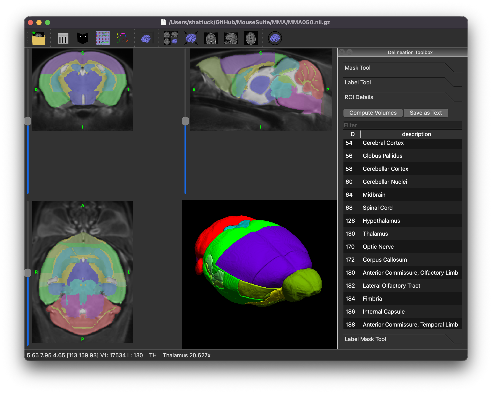

# MouseSuite MRI Atlas (MMA)
The MouseSuite MRI Atlas (MMA) is a MRI-based neuroanatomical reference atlas for use with atlas-based morphometry and volume microscopy registration.
The atlas currently comprises 41 neuroanatomical structures delineated upon an average template composed of 60 healthy (30 male, 30 female) T2-weighted C57BL/6J mouse brain images.
It provides a common space in which MRI and microscopy comparisons can be made.

## Authors
The  MouseSuite MRI Atlas was developed by Allan MacKenzie-Graham at UCLA.

## License
The MMA atlas is released under the Creative Commons Attribution-NonCommercial-ShareAlike 4.0 International License [CC-BY-NC-SA](https://creativecommons.org/licenses/by-nc-sa/4.0/)

## Contents
* [MMA050.nii.gz](MMA050.nii.gz) : the average template image, created from 60 healthy (30 male, 30 female) T2-weighted C57BL/6J mouse brain images.
* [MMA050.mask.nii.gz](MMA050.mask.nii.gz) : a brain-only mask for the template image.
* [MMA050.label.nii.gz](MMA050.label.nii.gz) : the neuroanatomical labels for the template image.
* [MMA050.label_description.xml](MMA050.label_description.xml) : a BrainSuite label description xml file.

## Acknowledgments
This project is supported by NIH Grant R01-NS121761 (PIs: David Shattuck and Allan MacKenzie-Graham).
